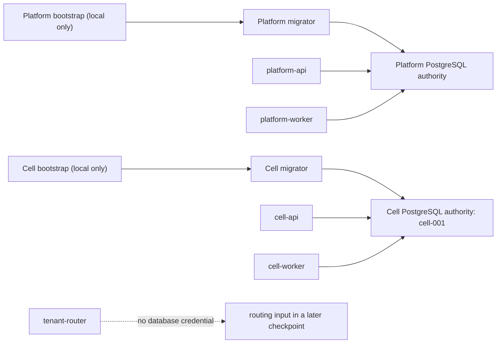

# Database authorities

Checkpoint 2 uses physically separate PostgreSQL authorities. The local Compose project starts one
Platform cluster and one Cell cluster; production topology remains deliberately unspecified.

No Platform role exists in the Cell cluster, and no Cell role exists in the Platform cluster.
Bootstrap roles are local-infrastructure and qualification authority only. They create the initial
role set and immutable `edtech_bootstrap.authority_identity` marker; their credentials are never
passed to a deployable process.

Each authority has one migrator, API, and worker login role. Runtime and migration roles are
`NOSUPERUSER`, `NOCREATEDB`, `NOCREATEROLE`, `NOREPLICATION`, and `NOBYPASSRLS`. Runtime roles have
no database CREATE/TEMP, no schema CREATE, own no application object, are not migrator members, and
cannot `SET ROLE` to the migrator. The migrator can create and own its authority's application
schemas and tables but cannot bypass RLS or manage databases/roles.

## Credential flow

Configuration carries only an opaque, debug-redacted `file:` reference with an absolute path.
`secret-resolution` performs a bounded one-time read and returns a `secrecy` value. Only the
PostgreSQL provider boundary explicitly exposes the material to SQLx. URLs, passwords, bind values,
and raw database errors are excluded from logs, process output, evidence, and Debug rendering.

`platform-api` and `platform-worker` compose only `platform-postgres`; `cell-api` and `cell-worker`
compose only `cell-postgres`. `db-migrator` resolves exactly one authority credential per
invocation. `tenant-router` rejects every database field because routing authority will arrive by a
separate mechanism in a later checkpoint.

## Authority and contract checks

Bootstrap owns the marker schema/table. Migration and runtime roles receive only USAGE/SELECT and
cannot mutate or replace it. The Platform marker requires `authority_kind=platform` and no Cell ID;
the Cell marker requires `authority_kind=cell` and `cell_id=cell-001`.

Before DDL, a migration adapter verifies PostgreSQL 18.4-or-newer within major 18, the marker, the
configured Cell identity where applicable, and the exact migrator privilege profile. It then uses
its own embedded migration set and history in `edtech_migrations`. A provider declares readiness
only after the same version/marker checks, exact runtime-role validation, and schema-contract
compatibility. Platform and Cell contract version 1 are independently owned.

Wrong-authority and wrong-Cell attempts fail before application DDL. Runtime credentials cannot
migrate; migrator credentials are rejected by runtime adapters. Real qualification also checks
history visibility, marker immutability, object ownership, public-schema emptiness, idempotency,
transactional failure, and concurrent migration serialization.
