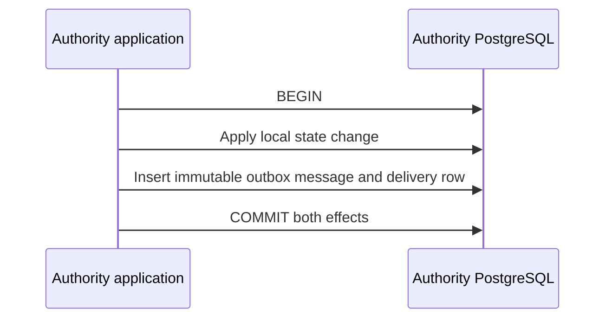
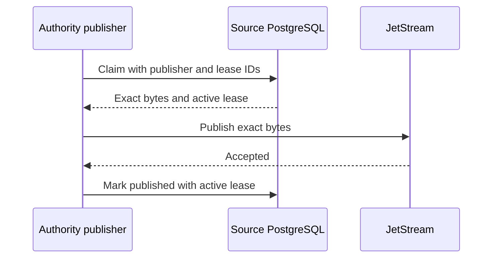

# Message delivery semantics

Messages are at-least-once, unordered, possibly duplicated, and possibly delayed. There is no
cross-database or distributed transaction. Broker ordering, deduplication, transactions, and a
future dead-letter queue never become business authority. No exactly-once delivery claim is made.

## Local transaction boundaries

A producer commits its local state and exact immutable outbox message in one authority-local
PostgreSQL transaction. Failure of either effect rolls back both. An outbox row means a committed
message awaits publication. A published timestamp means only that JetStream accepted the message;
it does not prove consumer handling.



A publisher claims eligible delivery rows using database time, `FOR UPDATE SKIP LOCKED`, a
bounded lease, and a UUIDv7 lease fence. Claim order is scheduling implementation, not delivery
authority. Expiry permits reclaim with a new fence; a stale or replaced fence cannot publish or
reschedule.



A consumer validates exact envelope bytes and its exact typed descriptor before beginning local
work. It then validates target and tenant fence, inserts or compares the named inbox receipt,
applies local effects, and inserts derived outbox messages in one local transaction. A JetStream
double acknowledgment occurs only after commit. One receipt proves only that one named handler
committed its authority-local transaction.

```mermaid
sequenceDiagram
    participant T as JetStream
    participant C as Consumer handler
    participant DB as Consumer PostgreSQL
    T->>C: Deliver exact envelope bytes
    C->>C: Validate envelope, descriptor, target, and fence
    C->>DB: BEGIN; receipt + local effects + derived outbox
    C->>DB: COMMIT
    C-->>T: Double acknowledgment after commit
```

## Expected duplicate windows

If a producer crashes after transport acceptance and before the published marker, the lease later
expires and the exact bytes are published again.

```mermaid
sequenceDiagram
    participant P as Authority publisher
    participant T as JetStream
    participant DB as Source PostgreSQL
    P->>T: Publish
    T-->>P: Accepted
    P-xP: Crash before marker
    DB-->>P: Lease expires; later reclaim publishes duplicate
```

If a consumer crashes after inbox commit and before acknowledgment, the transport delivers again.
The `(consumer_name, message_id)` receipt suppresses the duplicate only when immutable metadata and
bytes match. Different bytes are a conflict.

```mermaid
sequenceDiagram
    participant T as JetStream
    participant C as Consumer handler
    participant DB as Consumer PostgreSQL
    C->>DB: Commit receipt and effects
    C-xC: Crash before acknowledgment
    T->>C: Redeliver
    C->>DB: Exact receipt exists; skip second effect
```

Inbox deduplication does not prove exactly-once business processing. Broker deduplication is
insufficient because it cannot prove the consumer database transaction, distinguish handlers, or
replace business version, operation-ID, and assignment-epoch checks. Correlation is not
deduplication. A message ID is not automatically semantic idempotency.

A Cell rejects tenant work before receipt commit when the Cell is wrong, the tenant is absent or
disabled, or the epoch is stale or newer but unregistered. No receipt or derived message remains
after rejection or handler rollback.
