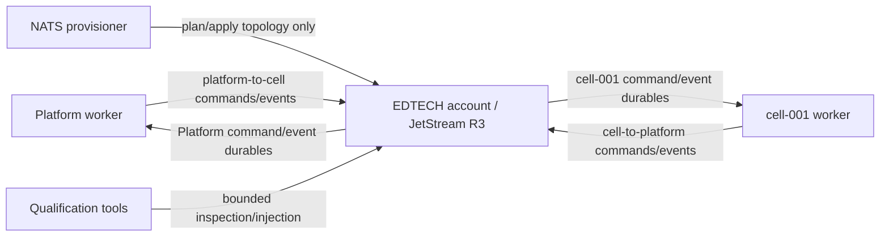

# NATS JetStream topology

Checkpoint 4 runs one `edtech-local` cluster of three NATS 2.14.3 nodes. Client and route
connections require TLS, username/password authentication, and certificate verification. Each node
has a unique `az` placement tag; JetStream metadata, production streams, and durable consumers use
three replicas. Local `az` tags test placement rules, not multi-zone availability: every container
runs on one Docker host.

## Accounts and users

The server has an `EDTECH` application account with JetStream enabled and a separate `$SYS`
monitoring account. Generated credential files are purpose-specific:

| User | Allowed purpose | Explicitly excluded |
|---|---|---|
| `platform-worker` | publish Platform-to-Cell; fetch/ack Platform durables | Cell publication, Cell durables, topology mutation |
| `cell-worker-cell-001` | publish cell-001-to-Platform; fetch/ack cell-001 durables | Platform publication, another Cell, topology mutation |
| `provisioner` | inspect and non-destructively create/update declared topology | application publication, consumption, database access |
| `qualification-injector` | exact negative-test application subjects | topology management and broad subscription |
| `qualification-inspector` | bounded topology/consumer inspection | production publication and mutation |
| `system` | local monitor/system inspection | application work |

APIs, `tenant-router`, and `db-migrator` have no transport configuration or NATS credential. The
provisioner has no database configuration or credential.

## Production streams

| Stream | Subject | Retention | Storage | Replicas | Bounds |
|---|---|---|---|---|---|
| `EDTECH_COMMANDS_V1` | `edtech.v1.command.>` | WorkQueue | file | 3 | 1,000,000 messages; 1 GiB; 7 days |
| `EDTECH_EVENTS_V1` | `edtech.v1.event.>` | Limits | file | 3 | 2,000,000 messages; 2 GiB; 30 days |

Both streams use DiscardNew, a 270,336-byte message limit, 2,048 consumer limit, two-minute
duplicate window, acknowledgments, no direct access, no republish, and no mirror/source. The
limits are qualification defaults, not production sizing guidance.

## Durable pull consumers

| Durable | Stream | Exact filter |
|---|---|---|
| `EDTECH_PLATFORM_COMMANDS_V1` | commands | `edtech.v1.command.cell-to-platform.>` |
| `EDTECH_CELL_CELL_001_COMMANDS_V1` | commands | `edtech.v1.command.platform-to-cell.cell-001.>` |
| `EDTECH_PLATFORM_EVENTS_V1` | events | `edtech.v1.event.cell-to-platform.>` |
| `EDTECH_CELL_CELL_001_EVENTS_V1` | events | `edtech.v1.event.platform-to-cell.cell-001.>` |

Every consumer is durable, pull-based, file-backed, R3, DeliverAll, ReplayInstant, and
AckExplicit. `AckWait` is 30 seconds; MaxDeliver is unlimited; MaxAckPending is 1,024; MaxWaiting is
64; MaxBatch is 200; MaxExpires is five seconds. There is no push subject, inactive auto-delete,
rate limit, sampling, backoff policy, maximum-delivery policy, or dead-letter implementation.
Command WorkQueue filters do not overlap.

## Provisioning and evolution

`infra/local/nats/templates/topology.toml` is the credential-free schema-1 manifest. Normal
`nats-provisioner` mode plans first, refuses the entire mutation phase if any unsafe drift exists,
then creates missing assets or applies approved monotonic increases and waits for leaders/current
replicas. `--check-transport` only inspects and reports. A repeated converged run reports no
changes.

Safe automatic changes are missing declared assets, increased message/byte/age or consumer
capacity, and approved description metadata. Subject removal/replacement, retention/storage
changes, replica or limit decreases, durable/filter/delivery/ack changes, sequence resets, purge,
deletion, and recreation are refused. Unknown `EDTECH_` assets stay visible and are never silently
deleted.

Cell durable names uppercase the validated CellId, replace hyphens with underscores, and add fixed
prefixes/suffixes. Because accepted Cell IDs cannot contain underscores, this mapping is
collision-free. Checkpoint 4 statically declares only `cell-001`; adding a Cell requires a reviewed
manifest and ACL change. A later Cell registry may drive controlled provisioning, but runtime
workers will continue binding rather than mutating topology.
