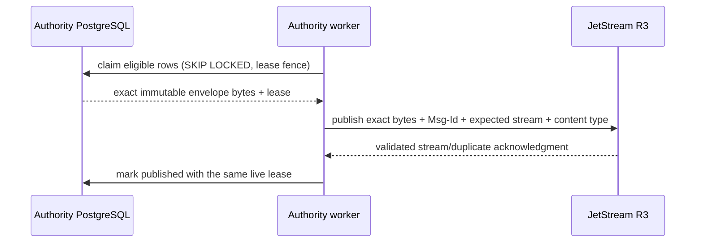
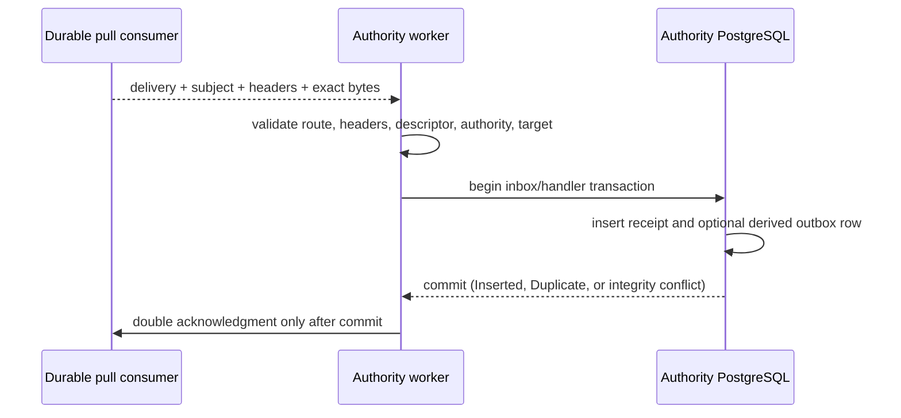
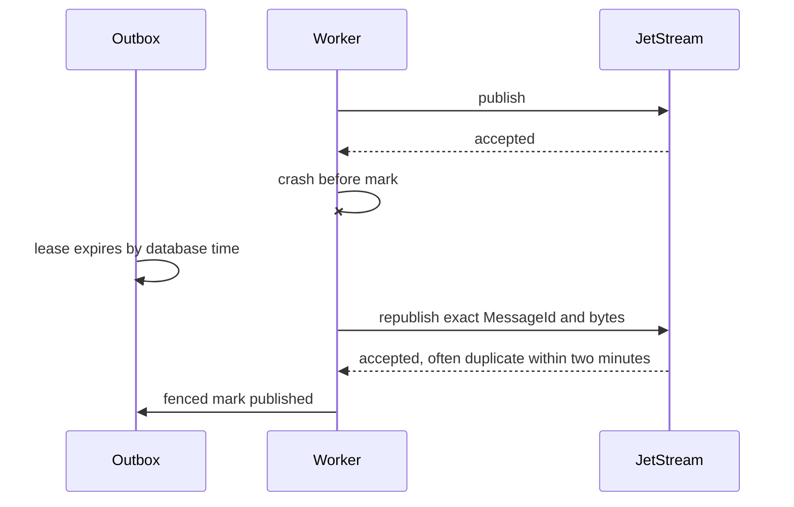
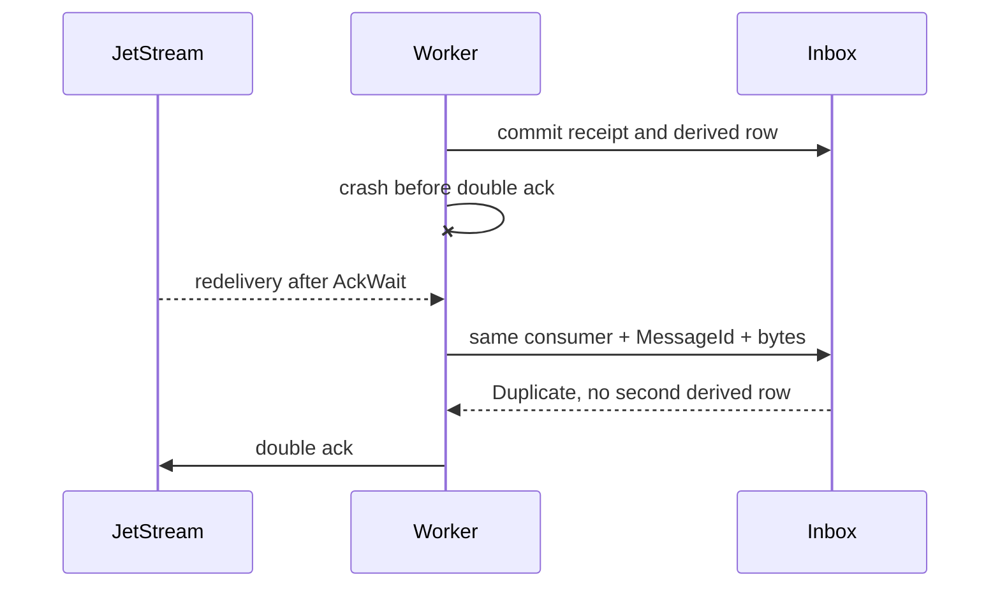

# Runtime message delivery

Transport acceptance, database publication marking, broker delivery, inbox commit, and business
completion are different facts. Published does not mean consumed. Checkpoint 4 supplies only the
operational probe handlers; later product handlers must define their own idempotency semantics.

## Outbox claim through JetStream acceptance



No row is marked before a validated acknowledgment. Timeout, unavailability, capacity rejection,
or another transient safe category reschedules with bounded exponential jitter. Authentication,
authorization, incompatible version, corrupt bytes, wrong-stream acknowledgment, and invariant
failures stop the supervised runtime. Stale leases cannot mark or reschedule.

## Delivery through commit and double acknowledgment



An inserted or exact duplicate receipt may be acknowledged. An integrity conflict is fatal. A
rollback, timeout, stale assignment, wrong authority/target, unsupported descriptor, or malformed
delivery gets no successful acknowledgment; retryable rejection uses a bounded delayed NAK.

## Broker accepted, worker crashes before marker



Broker duplicate suppression is a bounded optimization. Republish outside that window may create
another broker record; the destination inbox still suppresses a second derived effect.

## Inbox committed, worker crashes before acknowledgment



## Duplicate windows

Within the broker window, `Nats-Msg-Id` commonly returns a duplicate acknowledgment and avoids a
second stream record. Outside it, another record is permitted. In both cases the immutable
database inbox key and byte comparison are the durable local fence. No exactly-once business
guarantee follows from either mechanism.

## Stale assignment

```mermaid
sequenceDiagram
  JS-->>W: tenant-scoped delivery
  W->>DB: transactional assignment validation
  DB-->>W: stale, disabled, absent, or newer-unregistered
  W->>JS: delayed NAK; no receipt and no derived row
```

`u64::MAX` and values above `i64::MAX` remain valid because the assignment epoch is decoded from
decimal text and stored in the existing numeric domain without lossy casting.

## Quorum loss

```mermaid
sequenceDiagram
  W->>JS: publish while two nodes are unavailable
  JS--xW: no confirmed R3 acceptance
  W->>DB: reschedule; do not mark published
  Note over JS: restore quorum and elect leaders
  W->>JS: retry exact bytes
  JS-->>W: confirmed acceptance
  W->>DB: fenced mark published
```

Cancellation stops new claims/fetches. In-flight bounded database and acknowledgment work may
finish during grace. All three tasks are owned by `TaskSupervisor`; sibling failure cancels the
root, timeout aborts remaining work and returns failure, and NATS drain begins only after tasks stop
taking new work. Abandoned leases are left to expire through database time.
